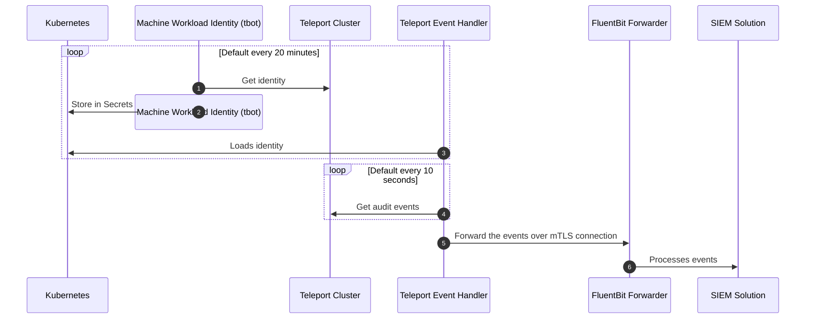

# Teleport Event Handler Plugin with FluentBit Forwarder

> [!CAUTION]
> Please note that this repository was developed for testing environments and should not be used as is in your production environment. It is intended to serve as a reference or example. Use at your own risk; no support or warranty provided.

A deployment guide for Teleport Event Handler with FluentBit Forwarder and MWI for cluster authentication.

Goal is to have the following components work in unison to provide a secure integration with your SEIM solution:
- Teleport Cluster
- Teleport Event Handler
- FluentBit Forwarder
- Machine & Workload Identity
- mTLS Authentication



---

## Table of Contents

- [Prerequisites](#prerequisites)
- [Machine ID Deployment](#machine-id-deployment)
  - [Create Kubernetes RBAC configuration](#create-kubernetes-rbac-configuration)
  - [Create Teleport `tbot` resources](#create-teleport-tbot-resources)
  - [Deploy Machine ID Bot](#deploy-machine-id-bot)
  - [Validate the Bot is functioning as expected](#validate-the-bot-is-functioning-as-expected)
- [Teleport Event Handler Deployment](#teleport-event-handler-deployment)
  - [mTLS Certificates Generation](#mtls-certificates-generation)
    - [Using `teleport-plugin-event-handler` image](#using-teleport-plugin-event-handler-image)
    - [Using OpenSSL tooling](#using-openssl-tooling)
      - [Set environment variables](#set-environment-variables)
      - [Generate mTLS certificates](#generate-mtls-certificates)
  - [Deploy mTLS Secrets to Kubernetes](#deploy-mtls-secrets-to-kubernetes)
  - [Deploy FluentBit Forwarder](#deploy-fluentbit-forwarder)
    - [Validate the FluentBit deployment](#validate-the-fluentbit-deployment)
  - [Deploy Teleport Event Handler Plugin](#deploy-teleport-event-handler-plugin)
- [Known Issues](#known-issues)
  - [mTLS Verification Issue](#mtls-verification-issue)
  - [TLS Subject Verification Issue](#tls-subject-verification-issue)
  - [Unsupported Status Code](#unsupported-status-code)
  - [Connection Issue](#connection-issue)
---

## Prerequisites

- Kubernetes
- Docker / OpenSSL CLI
- Helm
- `tsh`, `tctl` binaries installed on the local machine.
- Set default Kubernetes Namespace to minimise confusions and misconfiguration
  ```
  kubectl config set-context --current --namespace={{ ns }}
  ```

## Machine ID Deployment

It is recommended to use Machine ID daemon `tbot` to facilitate secure authentication with Teleport cluster in order to access audit events from the Teleport Cluster.

In this section we'll be deploying a `tbot` which we'll later use with the Event Handler for Teleport cluster authentication

### Create Kubernetes RBAC configuration
In order for the `tbot` to give us access to store secrets in the Kubernetes secret engine, following resource must be provisioned in the Namespace.
- `ServiceAccount`
- `Role`
- `RoleBinding`

Create a new file called `k8s-rbac.yaml` and add the below configuration

```yaml
---  
apiVersion: v1  
kind: ServiceAccount  
metadata:  
  name: event-handler-tbot  
---  
apiVersion: rbac.authorization.k8s.io/v1  
kind: Role  
metadata:  
  name: secrets-admin  
rules:  
  - apiGroups: [""]  
    resources: ["secrets"]  
    verbs: ["*"]  
---  
apiVersion: rbac.authorization.k8s.io/v1  
kind: RoleBinding  
metadata:  
  name: event-handler-tbot-secrets-admin  
subjects:  
  - kind: ServiceAccount  
    name: event-handler-tbot  
roleRef:  
  kind: Role  
  name:  secrets-admin  
  apiGroup: rbac.authorization.k8s.io  
---
```

Create the above resource in the Kubernetes cluster

```shell
kubectl apply -f ./k8s-rbac.yaml
```

### Create Teleport `tbot` resources
Now that we've created a `ServiceAccount` that allows modifying Kubernetes Secrets. We need to create a Machine ID bot to use that role to inject secrets in to the Kubernetes cluster for Event Handler to use for accessing audit logs.

Create a new file called `tbot.yaml` and the below configuration in the file

```yaml
kind: role  
metadata:  
  name: teleport-event-handler  
spec:  
  allow:  
    rules:  
      - resources: ['event', 'session']  
        verbs: ['list','read']  
version: v5  
---  
kind: bot  
version: v1  
metadata:  
  name: event-handler-tbot  
spec:  
  roles: [teleport-event-handler]  
---  
kind: token  
version: v2  
metadata:  
  name: event-handler-tbot  
spec:  
  bot_name: event-handler-tbot  
  roles:  
    - Bot  
  join_method: kubernetes  
  kubernetes:  
    type: static_jwks  
    static_jwks:  
      jwks: |
        {{ jwks }}
    allow:  
      - service_account: "{{ namespace }}:event-handler-tbot"  
---
```

Replace the following placeholder values with corresponding values:

| Key | Description |
| ---- | ----------- |
| `{{ jwks }}` | The public key of the Kubernetes cluster used to sign JWTs is exposed on the "JWKS" endpoint of the Kubernetes API server.<br><br>Bellow command can be used to retrieve the public key:<pre>kubectl proxy -p 8080&<br>curl http://localhost:8080/openid/v1/jwks<br>kill %1</pre> |
| `{{ namespace }}` | Kubernetes namespace defined at the top of this document. |

Create the bot resource on the Teleport cluster:

```shell
tctl create -f tbot.yaml
```

> You may require authenticating to the Teleport cluster first:
> ```shell
> tsh login --proxy={{ Teleport proxy URL }} --user={{ Teleport User }}
> ```

### Deploy Machine ID Bot
Now that we have both Teleport and Kubernetes cluster configured for `tbot`. A `tbot` agent need to be deployed on the Kubernetes namespace to begin the dynamic secret generation.

Create a new file called `k8s-deployment.yaml` and place the below configuration in it

```yaml
---  
apiVersion: v1  
kind: ConfigMap  
metadata:  
  name: event-handler-tbot-config  
data:  
  tbot.yaml: |  
    version: v2  
    onboarding:  
      join_method: kubernetes  
      token: event-handler-tbot  
    storage:  
      type: memory  
    proxy_server: {{ teleport-cluster-fqdn }}:443  
    outputs:  
      - type: identity  
        destination:  
          type: kubernetes_secret  
          name: event-handler-identity  
---  
apiVersion: apps/v1
kind: Deployment
metadata:
  name: tbot
spec:
  replicas: 1
  strategy:
    type: Recreate
  selector:
    matchLabels:
      app.kubernetes.io/name: tbot
  template:
    metadata:
      labels:
        app.kubernetes.io/name: tbot
    spec:
      containers:
        - name: tbot
          image: public.ecr.aws/gravitational/tbot-distroless:{{ version }}
          args:
            - start
            - -c
            - /config/tbot.yaml
          env:
            - name: POD_NAMESPACE
              valueFrom:
                fieldRef:
                  fieldPath: metadata.namespace
            - name: KUBERNETES_TOKEN_PATH
              value: /var/run/secrets/tokens/join-sa-token
            - name: TELEPORT_ANONYMOUS_TELEMETRY
              value: "1"
          volumeMounts:
            - mountPath: /config
              name: config
            - mountPath: /var/run/secrets/tokens
              name: join-sa-token
      serviceAccountName: event-handler-tbot
      volumes:
        - name: config
          configMap:
            name: event-handler-tbot-config
        - name: join-sa-token
          projected:
            sources:
              - serviceAccountToken:
                  path: join-sa-token
                  expirationSeconds: 600
                  audience: {{ teleport-cluster-name }}
---
```

Replace the following placeholder values with corresponding values:

| Key | Description |
| ---- | ----------- |
| `{{ teleport-cluster-fqdn }}` | FQDN of the Teleport cluster. Be sure to remove the schema (`https://`) prefix or update the `ConfigMap` appropriately. |
| `{{ version }}` | `tbot` image version. It is recommended to keep it with the same version as the Teleport Cluster. |
| `{{ teleport-cluster-name }}` | Name of the Teleport Cluster. This can be found in two places:<br><ul><li>**Zero Trust Access** > **Manage Clusters**<br></li><li> Using `tsh`<br><pre>tsh clusters -f yaml</pre></li></ul>|

Create the above resource in the Kubernetes cluster

```shell
kubectl apply -f ./k8s-deployment.yaml
```

### Validate the Bot is functioning as expected
- Check the deployment logs
  ```shell
  kubectl logs deploy/tbot -f
  ```
- Check the Kubernetes secrets in the namespace for `event-handler-identity`

If there are no errors, this will conclude the Machine ID part of this deployment and ready to export logs with Teleport Event Handler.

## Teleport Event Handler Deployment

Now that we've authentication between Teleport Cluster and Kubernetes Cluster working, we can deploy the Teleport Event Handler and the FluentBit Forwarder.

### mTLS Certificates Generation

Teleport Event Handler enforces the mutual TLS pattern when communicating with the forwarder. We can generate the required TLS certificates from the `teleport-plugin-event-handler` image or OpenSSL tooling, both cases are documented below.

> Assuming FluentBit forwarder runs as a sidecar of the Event Handler. Refer to the **[TLS Subject Verification Issue](#tls-subject-verification-issue)** below otherwise.

#### Using `teleport-plugin-event-handler` image

```shell
TELEPORT_CLUSTER_ADDRESS='{{ teleport-cluster-fqdn }}:443'
TELEPORT_VERSION='{{ version }}'
EXTRA_OPTS=''

docker run -v `pwd`:/opt/teleport-plugin -w /opt/teleport-plugin public.ecr.aws/gravitational/teleport-plugin-event-handler:${TELEPORT_VERSION} configure ${EXTRA_OPTS?} . ${TELEPORT_CLUSTER_ADDRESS}
```

| Key | Description |
| ---- | ----------- |
| `{{ teleport-cluster-fqdn }}` | FQDN of the Teleport cluster. Be sure to remove the schema (`https://`) prefix |
| `{{ version }}` | `teleport-plugin-event-handler` image version. It is recommended to keep it with the same version as the Teleport Cluster. |

#### Using OpenSSL tooling

##### Set environment variables
```shell
COUNTRY=
STATE=
LOCATION=
ORG=
ORG_UNIT=
SERVER_DNS=
PASSWORD=$(openssl rand -hex 12 | tee secret.txt)
```

##### Generate mTLS certificates
```shell
# Create server extension specifications
cat <<EOF | tee server.ext
authorityKeyIdentifier=keyid,issuer
basicConstraints=CA:FALSE
keyUsage = digitalSignature, keyEncipherment
extendedKeyUsage = serverAuth
subjectAltName = @alt_names

[alt_names]
DNS.1 = ${SERVER_DNS}
EOF

# Create client extension specifications
cat <<EOF | tee client.ext
authorityKeyIdentifier=keyid,issuer
basicConstraints=CA:FALSE
keyUsage = digitalSignature
extendedKeyUsage = clientAuth
subjectAltName = @alt_names

[alt_names]
DNS.1 = ${SERVER_DNS}
EOF

# Create CA key
openssl genpkey -algorithm RSA -out ca.key -pkeyopt rsa_keygen_bits:2048

# Create CA certificate (valid for 10 years)
openssl req -x509 -new -nodes -key ca.key -sha256 -days 3650 -out ca.crt -subj "/C=${COUNTRY}/ST=${STATE}/L=${LOCATION}/O=${ORG}/OU=${ORG_UNIT}/CN=CA"

# Create Server key
openssl genpkey -algorithm RSA -out server.key -aes256 -pkeyopt rsa_keygen_bits:2048 -pass pass:${PASSWORD}

# Create Server CSR
openssl req -new -key server.key -out server.csr -subj "/C=${COUNTRY}/ST=${STATE}/L=${LOCATION}/O=${ORG}/OU=${ORG_UNIT}/CN=Server" -passin pass:${PASSWORD}

# Create Server certificate (valid for 10 years)
openssl x509 -req -in server.csr -CA ca.crt -CAkey ca.key -CAcreateserial -out server.crt -days 3650 -sha256 -extfile server.ext -passin pass:${PASSWORD}

# Create Client key
openssl genrsa -out client.key 2048

# Create Client CSR
openssl req -new -key client.key -out client.csr -subj "/C=${COUNTRY}/ST=${STATE}/L=${LOCATION}/O=${ORG}/OU=${ORG_UNIT}/CN=Client"

# Create client certificate (valid for 10 years)
openssl x509 -req -in client.csr -CA ca.crt -CAkey ca.key -CAcreateserial -out client.crt -days 3650 -sha256 -extfile client.ext
```

### Deploy mTLS Secrets to Kubernetes

Create two Kubernetes secrets in the `namespace` to store the generated TLS resources:
- Event Handler Plugin (Client certificates)
- FluentBit (Server certificates)

```shell
kubectl create secret generic fluent-bit-tls --from-file=ca.crt=ca.crt,server.crt=server.crt,server.key=server.key

kubectl create secret generic tls-fluent-bit-client --from-file=ca.crt=ca.crt,client.crt=client.crt,client.key=client.key
```

### Deploy FluentBit Forwarder

With the TLS certificates available in the Kubernetes Secret engine, deploy the FluentBit forwarder.

Create a new file called `k8s-fluent-bit.yaml` with below configuration
> `outputs` is set to `stdout` for demonstration purposes. Update the `outputs` section to send the logs to desired SEIM solution

```yaml
---  
apiVersion: v1  
kind: ConfigMap  
metadata:  
  name: fluent-bit  
data:  
  fluent-bit.yaml: |  
    pipeline:  
      inputs:  
        - name: http  
          host: 0.0.0.0  
          port: 9999  
          successful_response_code: 200  
          tls: on  
          tls.verify: on  
          tls.ca_path: "/keys/"  
          tls.ca_file: "/keys/ca.crt"  
          tls.crt_file: "/keys/server.crt"  
          tls.key_file: "/keys/server.key"  
          tls.key_passwd: "{{ server_private_key_passphrase }}"  
        
      outputs:  
        - name: stdout  
          match: '*'  
---  
apiVersion: apps/v1  
kind: Deployment  
metadata:  
  name: fluent-bit-forwarder  
  labels:  
    app: fluent-bit  
spec:  
  selector:  
    matchLabels:  
      app: fluent-bit  
  template:  
    metadata:  
      labels:  
        app: fluent-bit  
    spec:  
      containers:  
        - name: fluent-bit  
          image: fluent/fluent-bit:4.0
          args:  
            - /fluent-bit/bin/fluent-bit  
            - -c  
            - /fluent-bit/etc/fluent-bit.yaml  
            - -v  
          ports:  
            - containerPort: 9999
          resources:  
            requests:  
              cpu: "100m"  
              memory: "128Mi"  
            limits:  
              cpu: "200m"  
              memory: "512Mi"  
          volumeMounts:  
            - name: config  
              mountPath: /fluent-bit/etc/  
            - name: tls-keys  
              mountPath: /keys  
      volumes:  
        - name: config  
          configMap:  
            name: fluent-bit  
        - name: tls-keys  
          secret:  
            secretName: fluent-bit-tls  
            defaultMode: 0644  
---  
apiVersion: v1  
kind: Service  
metadata:  
  name: fluent-bit  
spec:  
  selector:  
    app: fluent-bit  
  ports:  
    - name: https  
      port: 443  
      targetPort: 9999  
---
```

| Key | Description |
| ---- | ----------- |
| `{{ server_private_key_passphrase }}` | Passphrase to decrypt the `server.key`<br>Passphrase can be found in the generated `fluent.conf` or in the `secret.txt` file<br><pre>cat fluent.conf \| grep private_key_passphrase</pre> |

Create the above resource in the Kubernetes cluster

```shell
kubectl apply -f ./k8s-fluent-bit.yaml
```

#### Validate the FluentBit deployment

Check the deployment logs
```shell
kubectl logs deploy/fluent-bit-forwarder -f
```

### Deploy Teleport Event Handler Plugin

Once the FluentBit forwarder deployed successfully, final part of this is to deploy the Teleport Event Handler Plugin.

Create a new file called `teleport-plugin-event-handler-values.yaml` with below configuration

```yaml
eventHandler:  
  storagePath: "./storage"  
  timeout: "10s"  
  batch: 20  
  namespace: "{{ namespace }}"  
  windowSize: "24h"  
  types: []  
  skipEventTypes: []  
  skipSessionTypes: []  
  
teleport:  
  address: "{{ teleport-cluster-fqdn }}:443"  
  identitySecretName: teleport-event-handler-identity  
  identitySecretPath: identity  
  
fluentd:  
  url: "https://fluent-bit.{{ namespace }}.svc.cluster.local/events.log"  
  sessionUrl: "https://fluent-bit.{{ namespace }}.svc.cluster.local/session.log"  
  certificate:  
    secretName: "tls-fluent-bit-client"  
    caPath: "ca.crt"  
    certPath: "client.crt"  
    keyPath: "client.key"  
  
persistentVolumeClaim:  
  enabled: true
```

| Key | Description |
| ---- | ----------- |
| `{{ teleport-cluster-fqdn }}` | FQDN of the Teleport cluster. Be sure to remove the schema (`https://`) prefix |
| `{{ namespace }}` | Kubernetes namespace defined at the top of this document. |

Create the above resource in the Kubernetes cluster

```shell
helm install teleport-plugin-event-handler teleport/teleport-plugin-event-handler --values teleport-plugin-event-handler-values.yaml --version {{ version }}
```

| Key | Description |
| ---- | ----------- |
| `{{ version }}` | `teleport-plugin-event-handler` image version. It is recommended to keep it with the same version as the Teleport Cluster. |


## Known Issues

### mTLS Verification Issue

> In some cases, you may encounter following error:
> ```
> Original Error: *url.Error Post &#34;https://fluent-bit.teleport.svc.cluster.local/events.log&#34;: remote error: tls: unknown certificate authority
> ```
> This is caused by chain of trust issue when generating the `server.crt`

#### Solution

In order to fix this issue, disable the chain of trust verification. Update the following line in the `ConfigMap` above.

```yaml
tls.verify: off
```

### TLS Subject Verification Issue

> You may encounter below error as the Client certificate is issued under `Subject Alternative Name: localhost`
>
> ```
> ERRO  Failed to export event, retrying... error:[
>ERROR REPORT:
>Original Error: *url.Error Post &#34;https://fluentd.teleport.svc.cluster.local/events.log&#34;: tls: failed to verify certificate: x509: certificate is valid for localhost, not fluentd.teleport.svc.cluster.local
> ```

#### Solution

Add a Alternative Subject Name to the `cleint.crt` during generation
```shell
EXTRA_OPTS='--dns-names=fluent-bit.{{ namespace }}.svc.cluster.local'
```

| Key | Description |
| ---- | ----------- |
| `{{ namespace }}` | Kubernetes namespace defined at the top of this document. |

### Unsupported Status Code

Due to FluentBit responding with `201` status code instead of the `200` that Event Handler expecting, this can result in Event Handler spamming the FluentBit forwarder with retry attempts and adding duplicated records.

```
User Message: Failed to send event to fluentd (HTTP 201)] attempts:5 event-handler/app.go:133
ERRO  Failed to export event, retrying... error:[
ERROR REPORT:
Original Error: *errors.errorString Failed to send event to fluentd (HTTP 201)
```

#### Solution

This issue can be addressed by changing the FluentBit server `input` response code.
```
successful_response_code: 200
```

### Connection Issue

This is a common issue that can be caused by not rotating the Service Endpoint created for a deployment after the deployment in question was delete and created. This causes Service Endpoint to become stale and loose the network connectivity.

```
Original Error: *url.Error Post &#34;https://fluent-bit.teleport.svc.cluster.local/events.log&#34;: dial tcp 172.20.141.152:443: connect: connection refused
```

#### Solution

Delete the offending `Service` endpoint and recreate is after the re-deployment is created.