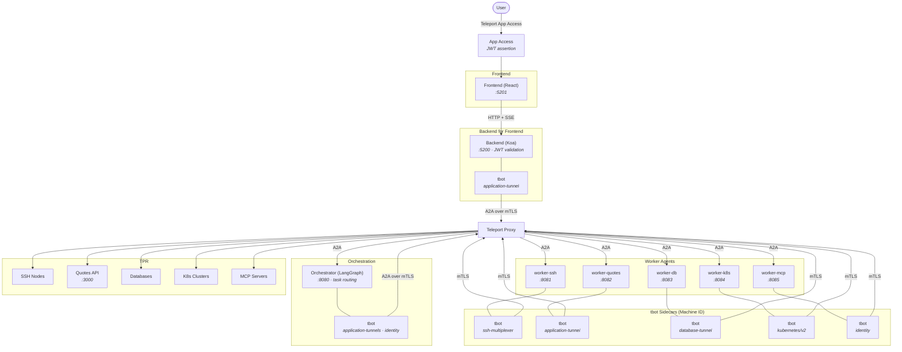

# Agentic Identity Demo -- Teleport Multi-Agent Security

This demo shows how Teleport secures multi-agent AI workflows with per-agent Machine Identity, mTLS between all services, and zero application-level RBAC. Each AI agent operates as its own identity ("digital twin") via tbot sidecars, and all inter-service communication is authenticated and encrypted through Teleport -- no secrets in code, no RBAC logic in the app.

## How Teleport Secures This

- **Per-agent Machine Identity** -- Each worker gets its own tbot sidecar with a unique `BOT_NAME`, issuing short-lived certificates via Teleport Machine ID.
- **mTLS everywhere** -- All inter-service calls (backend to orchestrator, orchestrator to workers) go through Teleport tunnels with mutual TLS. No plaintext HTTP between services in production.
- **Zero application RBAC** -- The application contains no authorization code. Teleport roles control which resources each agent can access (SSH nodes, databases, apps, Kubernetes clusters).
- **Full per-agent audit trail** -- Every action by every agent is logged in the Teleport audit log under its own bot identity, giving complete attribution.
