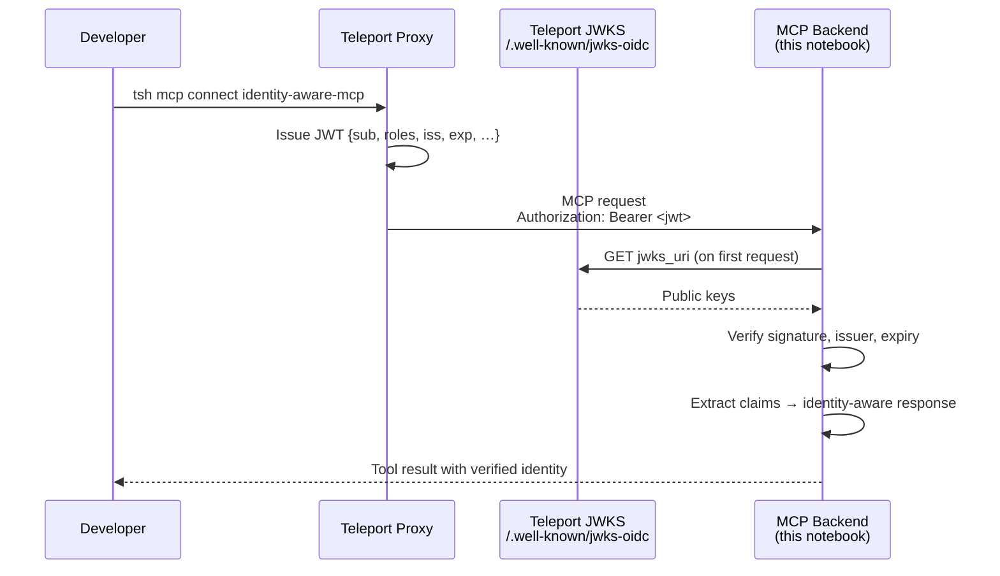

# MCP Auth Basic — Teleport JWT Verification

This demo shows the foundational auth mechanism that every MCP integration in this series builds on: **Teleport issues a signed JWT; the MCP backend verifies it.**

When a developer runs `tsh mcp connect`, Teleport injects a short-lived JWT into the `Authorization` header before forwarding the request to the backend. The backend validates the JWT against Teleport's public JWKS endpoint, extracts the caller's identity and roles, and drives behavior from those claims — without trusting anything the client sends directly.

Later notebooks in this series layer on AgentCore Gateway, interceptor Lambdas, and Cedar policies, but all of that sits on top of what this notebook demonstrates.

## How It Works



### Key JWT Claims

| Claim | Example                           | Meaning |
|:------|:----------------------------------|:--------|
| `sub` | `<teleport registered id>`        | Teleport identity (provider/username) |
| `roles` | `["mcp-user", "access"]`          | Teleport roles assigned to the user |
| `iss` | `https://yourcluster.teleport.sh` | Issuing cluster URL |
| `aud` | `mcp+https://…`                   | Intended audience (the registered app URI) |
| `exp` | Unix timestamp                    | Expiry — Teleport JWTs are short-lived |

## Prerequisites

- `tsh` and `tctl` (Teleport 17+)
- `teleport` binary (to run the local agent)
- Python 3.11+ with `pip`
- Active `tsh login` session

```bash
tsh status
tctl status
```

## Setup

### 1. Configure your environment

```bash
cp .env.example .env
# Edit .env → set TELEPORT_CLUSTER=yourcluster.teleport.sh
```

### 2. Install dependencies

```bash
pip install -r requirements.txt
```

Or use the shared venv at the repo root:

```bash
cd .. && python -m venv .venv && source .venv/bin/activate
pip install -r mcp-auth-basic/requirements.txt
```

### 3. Generate a join token and add it to `.env`

```bash
tctl tokens add --type=app --ttl=1h
# Copy the token value into .env as TELEPORT_TOKEN=...
```

### 4. Run the notebook

Open [`jwt-verification.ipynb`](jwt-verification.ipynb) in Jupyter and run all cells in order.

The notebook:

1. Fetches Teleport's OIDC discovery document to get the JWKS URI
2. Starts a FastMCP server with `JWTVerifier` wired in as the auth layer
3. Registers a `whoami` tool that returns the caller's verified identity and capabilities
4. Writes `teleport.yaml` from your env vars and starts the Teleport agent
5. Connects via `tsh mcp connect` and calls `whoami` to confirm end-to-end JWT flow

## What the Demo Shows

After running the notebook you should see output like:

```
You were called by alice@acme.com on yourcluster.teleport.sh
with roles [admin, access, mcp-user]
and read and write capabilities (token expires 2026-05-22 12:55 UTC).
```

This confirms:

- Teleport issued and signed the JWT
- The backend verified the signature against the JWKS endpoint
- Role-to-capability mapping works (`mcp-user` → read, `admin` → write)
- The caller's identity came from Teleport, not a client-supplied header

## Key Files

| File | Purpose |
|------|---------|
| `jwt-verification.ipynb` | Interactive walkthrough — run this; generates `teleport.yaml` |
| `.env.example` | Environment variable template |
| `requirements.txt` | Python dependencies |

## How the Auth Layer Works

Three components in the notebook set up JWT validation:

- **`JWTVerifier`** — fetches Teleport's public keys via JWKS and validates every inbound JWT (issuer, signature, expiry). Keys are cached and rotated automatically.
- **`FastMCP(auth=verifier)`** — wires the verifier into the server; unauthenticated or invalid requests are rejected before any tool handler runs.
- **`CurrentAccessToken()`** — injects the verified token into the tool handler so claims are available without re-parsing.

## Important Notes

- `teleport.yaml` is generated by the notebook and gitignored — it is never committed
- The `debug_app: true` flag written into `teleport.yaml` enables a diagnostic page at `/teleport-debug` showing forwarded headers and raw JWT claims — useful for troubleshooting but should be disabled in production
- Teleport JWTs are short-lived (minutes); the server automatically refreshes the JWKS cache when keys rotate
- The `audience` check is omitted in this demo because the app URI varies per deployment — add it in production

## Cleanup

Stop the Teleport agent with `Ctrl+C`, then stop the MCP server by running the last cell in the notebook.

To remove the app registration from Teleport:

```bash
tctl rm app/identity-aware-mcp
```