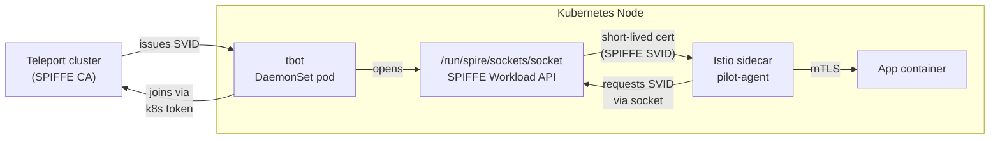
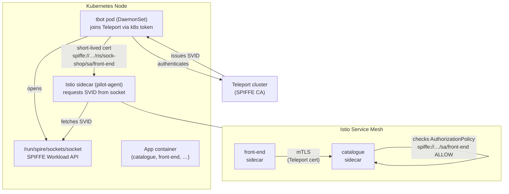
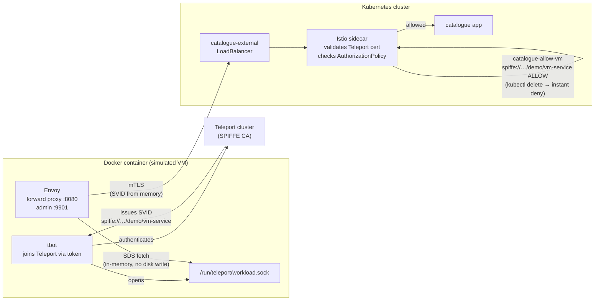

# Istio + Teleport Workload Identity

This repo demonstrates Teleport Workload Identity integrated with an Istio service mesh. The standard Istio installation manages its own internal certificate authority (CA) called Citadel. These demos **replace Citadel with Teleport** — so every workload in the mesh gets a cryptographic identity rooted in Teleport, not a cluster-local self-signed CA.

The identity standard used throughout is [SPIFFE](https://spiffe.io/) (Secure Production Identity Framework For Everyone). A SPIFFE ID looks like:

```
spiffe://your-teleport-cluster/ns/sock-shop/sa/front-end
```

Istio `AuthorizationPolicy` rules reference these IDs directly. Access control becomes a question of *who the caller cryptographically is*, not just its IP address or Kubernetes label.

## Why This Matters

| Standard Istio | With Teleport Workload Identity |
|---|---|
| Citadel issues certs from a cluster-local CA | Teleport issues certs — same CA used for SSH, databases, apps |
| Cert rotation is internal to the cluster | Teleport manages rotation, revocation, and audit centrally |
| Identity is cluster-scoped | Identity works for both in-mesh pods *and* off-cluster VMs |
| Authorization policy references labels or IPs | Authorization policy references cryptographic SPIFFE IDs |

Short cert TTLs (4-minute lifetime, rotated every 2 minutes by tbot) minimize the blast radius of any compromised credential.

## How It Works

tbot runs as a DaemonSet — one pod per Kubernetes node. It joins Teleport using a Kubernetes-native join token (no static secrets), then opens a **SPIFFE Workload API** Unix socket on the node filesystem. Istio sidecars (pilot-agent) detect the socket and use it to fetch SVIDs from Teleport instead of calling Citadel.



Each pod gets a unique cryptographic identity. Istio enforces mTLS using those certs for every service-to-service call.

## The Two Demos

### [Part 1 — In-Cluster mTLS](README-part1.md)

The foundational demo. Teleport replaces Citadel as the mesh CA. The [Sock Shop](https://github.com/microservices-demo/microservices-demo) microservices app is deployed into the mesh, and each service gets a Teleport-issued SPIFFE identity. The demo walks through:

1. Validating that every sidecar holds a Teleport-issued cert with the correct SPIFFE SAN
2. Applying a deny-all `AuthorizationPolicy` — the app breaks immediately
3. Restoring access with SPIFFE-based allow policies — only the right callers, on the right paths
4. Confirming mTLS is active on the wire via Envoy stats
5. Showing that an unauthorized pod (wrong SPIFFE ID) is blocked

**Run with:** [`demo-walkthrough.ipynb`](demo-walkthrough.ipynb) | [Detail →](README-part1.md)

---

### [Part 2 — Off-Cluster VM via mTLS](README-part2.md)

Extends Part 1 by bringing an off-cluster workload into the same identity fabric. A Docker container simulates a VM running outside Kubernetes. tbot on the VM joins Teleport with a one-time token, then serves the SPIFFE Workload API locally. Envoy on the VM fetches the SVID **entirely in-memory via SDS** — no certificate files are ever written to disk. The demo walks through:

1. Showing there are no cert files anywhere on the VM filesystem
2. Confirming the SVID is present in Envoy's memory (`/certs` admin endpoint)
3. Making a successful mTLS request from the VM to `catalogue` inside the cluster
4. Deleting the `AuthorizationPolicy` with a single `kubectl delete` — VM is instantly locked out (HTTP 503), no restarts
5. Re-applying the policy — access restored, still no restarts or cert changes

**Requires Part 1 to be deployed first.**

**Run with:** [`demo-walkthrough-part2.ipynb`](demo-walkthrough-part2.ipynb) | [Detail →](README-part2.md)

---

## Prerequisites

- `kubectl` (1.27+), `istioctl` (1.28+), `tctl`, `tsh`
- Kubernetes cluster admin access
- Teleport cluster admin access (`tsh login` completed)
- `docker` and `docker compose` (Part 2 only)

```bash
kubectl cluster-info
istioctl version --remote=false
tctl status
```

## Quick Start

```bash
# 1. Set your Teleport cluster domain
cp .env.example .env
# edit .env → set TELEPORT_TRUST_DOMAIN=your-cluster.teleport.sh
./configure-trust-domain.sh

# 2. Follow Part 1 notebook for the in-cluster setup
# 3. Follow Part 2 notebook for the off-cluster VM extension
```

## Architecture: Part 1 — In-Cluster mTLS



## Architecture: Part 2 — Off-Cluster VM via mTLS


