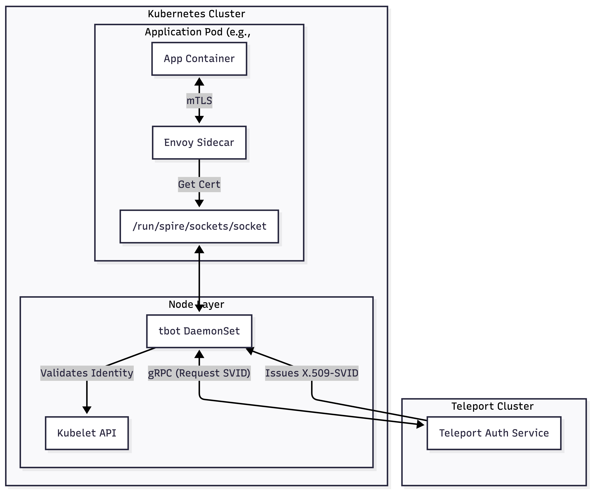

# Istio + Teleport Workload Identity Demo

Demo showing Teleport-issued SPIFFE identities integrated with Istio service mesh on Kubernetes.

## What This Demo Shows

- Teleport issues SPIFFE identities to workloads instead of Istio's built-in CA
- Istio uses Teleport certificates for mTLS between services
- Identity-based authorization policies using SPIFFE IDs
- Zero-trust networking with workload attestation

**For detailed background and architecture, see [blog post link].**

## Prerequisites

**Required Tools:**
- `kubectl` (1.27+)
- `istioctl` (1.28+)
- `tctl` and `tsh` (Teleport CLI tools)

**Required Access:**
- Kubernetes cluster admin access
- Teleport cluster admin access (logged in via `tsh login`)

**Verify:**
```bash
kubectl cluster-info
istioctl version
tctl status
```

## Configuration

### Set Your Teleport Trust Domain

Configure your Teleport cluster domain before starting:

```bash
# 1. Copy the example environment file
cp .env.example .env

# 2. Find your Teleport cluster domain
tctl status | grep "Cluster"

# 3. Edit .env and set TELEPORT_TRUST_DOMAIN to your cluster domain
# Example: TELEPORT_TRUST_DOMAIN=example.teleport.sh

# 4. Run the configuration script to update all files
./configure-trust-domain.sh
```

This script automatically updates:
- [istio/istio-config.yaml](istio/istio-config.yaml) - Istio mesh trust domain
- [tbot/tbot-config.yaml](tbot/tbot-config.yaml) - tbot proxy server
- [tbot/tbot-daemonset.yaml](tbot/tbot-daemonset.yaml) - Service account token audience
- [sockshop/sock-shop-policies.yaml](sockshop/sock-shop-policies.yaml) - Authorization policy principals

The trust domain is also used by validation scripts ([validate-spiffe-ids.sh](validate-spiffe-ids.sh), [teleport-cert-demo.sh](teleport-cert-demo.sh)) which automatically read from `.env`.

## Quick Start

### 1. Install Istio with SPIFFE Integration

```bash
./istio-install.sh
```

Verify:
```bash
kubectl get pods -n istio-system
```

### 2. Create Teleport Resources

**Extract cluster JWKS and create join token:**
```bash
./create-token.sh
```

**Create Teleport resources:**
```bash
# Create join token in Teleport
tctl create -f istio/istio-tbot-token.yaml

# Create bot role
tctl create -f tbot/teleport-bot-role.yaml

# Create workload identity
tctl create -f tbot/teleport-workload-identity.yaml
```

Verify:
```bash
tctl get token/istio-tbot-k8s-join
tctl get role/istio-workload-identity-issuer
tctl get workload_identity/istio-workloads
```

### 3. Deploy tbot

```bash
kubectl apply -f tbot/tbot-rbac.yaml
kubectl apply -f tbot/tbot-config.yaml
kubectl apply -f tbot/tbot-daemonset.yaml
```

Verify (should see one pod per node):
```bash
kubectl get pods -n teleport-system
```

Check logs for successful startup:
```bash
kubectl logs -n teleport-system -l app=tbot --tail=20 | grep "Workload API"
```

### 4. Deploy Sock Shop Demo

```bash
kubectl apply -f sockshop/sock-shop-demo.yaml
```

Wait for all pods (1-2 minutes):
```bash
kubectl get pods -n sock-shop -w
```

All pods should show `2/2` READY (app + istio-proxy sidecar).

### 5. Verify SPIFFE Integration

**What we're checking:** This step confirms that Istio sidecars are successfully receiving SPIFFE identities from Teleport (via tbot) instead of using Istio's default certificate authority. Each service should have a certificate with a SPIFFE ID that matches the format `spiffe://YOUR-DOMAIN/ns/<namespace>/sa/<service-account>`.

**Check SPIFFE IDs:**
```bash
./validate-spiffe-ids.sh
```

Expected output shows matching SPIFFE IDs for each service:
```
=== Service: front-end ===
Expected: spiffe://YOUR-DOMAIN/ns/sock-shop/sa/front-end
Actual:   spiffe://YOUR-DOMAIN/ns/sock-shop/sa/front-end
✅ SPIFFE ID matches!
```

**Check certificates:**
```bash
./teleport-cert-demo.sh
```

### 6. Test Application (Without Policies)

**What we're checking:** At this point, mTLS is enabled using Teleport-issued certificates, but no authorization policies have been applied yet. This means all services can communicate with each other freely - the mesh is encrypting traffic but not restricting it. This baseline test confirms the application works before we add zero-trust policies.

**Verify frontend service and get IP:**
```bash
# Check service has external IP
kubectl get svc -n sock-shop front-end

# Set FRONTEND_IP variable
FRONTEND_IP=$(kubectl get svc -n sock-shop front-end -o jsonpath='{.status.loadBalancer.ingress[0].ip}')

# Test access
curl http://$FRONTEND_IP/
curl http://$FRONTEND_IP/catalogue
```

Both should work - all services can talk to each other because there are no authorization policies yet.

### 7. Apply Zero-Trust Policies

**Break it with deny-all:**
```bash
kubectl apply -f sockshop/sock-shop-deny-all.yaml

# Test - should FAIL
curl http://$FRONTEND_IP/catalogue
```

**Fix it with allow policies:**
```bash
kubectl apply -f sockshop/sock-shop-policies.yaml

# Test - should WORK again
curl http://$FRONTEND_IP/catalogue
```

### 8. Verify mTLS and Authorization

**Check mTLS is working:**
```bash
POD=$(kubectl get pod -n sock-shop -l app=catalogue -o jsonpath='{.items[0].metadata.name}')

kubectl exec -n sock-shop $POD -c istio-proxy -- \
  curl -s localhost:15000/stats | grep "connection_security_policy.mutual_tls"
```

Look for "connection_security_policy.mutual_tls" to confirm that the communication policy is set to mTLS.

**Test unauthorized access is blocked:**
```bash
# Create test pod without proper identity
kubectl run test-curl -n sock-shop --image=curlimages/curl:latest --restart=Never -- \
  sh -c "curl -v http://catalogue/catalogue 2>&1; sleep 10"

# Should see connection failures
kubectl logs test-curl -n sock-shop

# Cleanup
kubectl delete pod test-curl -n sock-shop
```

## What's Happening

1. **tbot DaemonSet** runs on each node, provides SPIFFE Workload API via Unix socket at `/run/spire/sockets/socket`
2. **Istio sidecars** connect to the socket and request certificates
3. **Teleport issues certificates** with SPIFFE IDs: `spiffe://YOUR-DOMAIN/ns/<namespace>/sa/<service-account>`
4. **Istio enforces mTLS** using Teleport-issued certificates instead of its own CA
5. **Authorization policies** use SPIFFE IDs to control service-to-service access

## Key Configuration Files

**Istio:**
- [istio/istio-config.yaml](istio/istio-config.yaml) - Istio mesh config with SPIFFE integration
- [istio-install.sh](istio-install.sh) - Installation script

**Teleport:**
- [tbot/teleport-bot-role.yaml](tbot/teleport-bot-role.yaml) - Bot role for issuing identities
- [tbot/teleport-workload-identity.yaml](tbot/teleport-workload-identity.yaml) - SPIFFE ID template
- [istio/istio-tbot-token.yaml.template](istio/istio-tbot-token.yaml.template) - Join token template (cluster-specific JWKS required)

**tbot:**
- [tbot/tbot-rbac.yaml](tbot/tbot-rbac.yaml) - Kubernetes RBAC
- [tbot/tbot-config.yaml](tbot/tbot-config.yaml) - tbot configuration
- [tbot/tbot-daemonset.yaml](tbot/tbot-daemonset.yaml) - DaemonSet deployment

**Demo App:**
- [sockshop/sock-shop-demo.yaml](sockshop/sock-shop-demo.yaml) - Microservices application
- [sockshop/sock-shop-deny-all.yaml](sockshop/sock-shop-deny-all.yaml) - Default deny policy
- [sockshop/sock-shop-policies.yaml](sockshop/sock-shop-policies.yaml) - SPIFFE-based authorization policies

**Scripts:**
- [create-token.sh](create-token.sh) - Extract cluster JWKS and create join token
- [validate-spiffe-ids.sh](validate-spiffe-ids.sh) - Verify SPIFFE IDs
- [teleport-cert-demo.sh](teleport-cert-demo.sh) - Show certificate details
- [cleanup.sh](cleanup.sh) - Remove all resources

## Important Notes

**Security:**
- `istio/istio-tbot-token.yaml` (generated) contains cluster-specific secrets and is gitignored - NEVER commit it
- Each cluster has unique JWKS - always run `create-token.sh` for your cluster

**SPIFFE ID Format:**
- Must include `/sa/` component: `/ns/<namespace>/sa/<service-account>`
- Trust domain must match your Teleport cluster domain
- No trailing slashes allowed

**Configuration:**
- Istio path normalization must be `NONE` for SPIFFE compatibility
- Socket path is `/run/spire/sockets/socket` (standard SPIFFE location)
- Istio injection uses custom `spire` template (see [istio/istio-config.yaml](istio/istio-config.yaml))

## Cleanup

Remove everything:
```bash
./cleanup.sh
```

This removes:
- Istio (istio-system namespace)
- tbot (teleport-system namespace)
- Sock Shop (sock-shop namespace)
- Teleport resources (via tctl)
- Generated token files (optional)

## Architecture Diagram



Each workload gets a unique cryptographic identity from Teleport, enabling zero-trust service-to-service authentication in the mesh.
